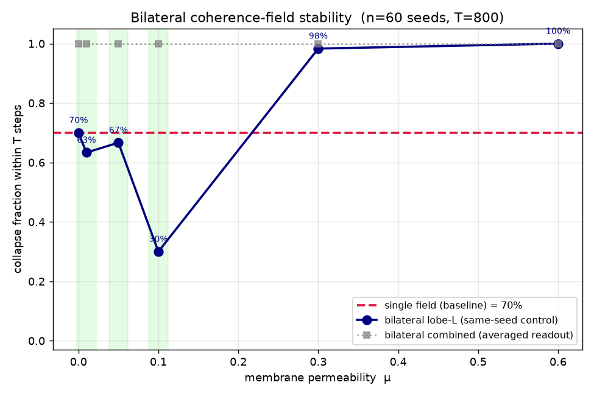

# VERDICT — Does bifurcation reduce collapse?

> **⚠️ READ `CONTROLS_VERDICT.md` ALONGSIDE THIS — it materially qualifies the claim
> below.** An adversarial control battery (T1–T4 + long-T) established two things:
> (1) the membrane effect is **real and specifically mirror-structured** (matched noise
> can't reproduce it; only mirror coupling, not any co-evolving partner, helps); but
> (2) what it does is **DELAY collapse, not prevent it** — at σ=0.007 the regime is
> monostable and by T≈1200 *every* architecture (single and bilateral) is 100% locked.
> The "70% → 30%" below is a **T=800 clock reading**, threshold-inflated and read from a
> *unimodal* cluster. Honest statement: *mirror coupling specifically postpones lock*;
> it does **not** create a sustained alive state. Treat the numbers here as the
> *discovery* pass and `CONTROLS_VERDICT.md` as the *audited* conclusion.

**YES.** A bilateral (two-lobe) coherence field with **partial** corpus-callosum
coupling resists standing-wave collapse far better than a single field — and the
benefit has the exact band structure the bilateral hypothesis predicts. Too little
coupling does nothing; too much makes things *worse* than a single field.

> All numbers below are raw output of `run_experiment.py` (pure numpy, 64×64 torus,
> field dynamics lifted from `eris/field/pde.py`). Headline metric = **lobe-L
> collapse fraction**, where lobe L is seeded identically to the single-field
> baseline, so μ=0 is an exact control.

---

## Headline: collapse-fraction vs μ (the decisive sweep)

Metastable regime (`omega_spread=0.25, sigma_noise=sigma_phase=0.007, r_sat=0.85,
phi_init=0.85`), **n=60 seeds, T=800 steps**. Collapse = LOCK ∪ DEATH ∪ DIVERGE.

| μ (membrane permeability) | lobe-L collapse | alive/locked | vs single | median collapse step |
|---|---|---|---|---|
| **single field (baseline)** | **70%** | 18 / 42 | — | 733 |
| 0.00 | 70% | 18 / 42 | ±0% *(exact control — identical to single)* | 733 |
| 0.01 | 63% | 22 / 38 | −7% | 727 |
| 0.05 | 67% | 20 / 40 | −3% | 718 |
| **0.10** | **30%** | **42 / 18** | **−40%**  ✅ | 778 *(locks later, too)* |
| 0.30 | 98% | 1 / 59 | +28% *(worse)* | 677 *(locks sooner)* |
| 0.60 | 100% | 0 / 60 | +30% *(worse)* | 554 *(locks much sooner)* |

**The win is real, not noise.** Single 42/60 vs μ=0.1 18/60 collapses:
two-proportion z = **4.38**, two-sided **p = 1.2×10⁻⁵**.

**The band is exactly as hypothesised:**

* **μ = 0** (two independent fields): no benefit — lobe L is bit-for-bit the single
  field. Outcomes `{ALIVE:18, LOCK:42}` match the baseline exactly. ✔ control holds.
* **μ ≈ 0.1** (partial / permeable membrane): collapse **70% → 30%**, and the runs
  that do lock, lock *later* (median 733 → 778). This is the predicted win.
* **μ ≥ 0.3** (over-coupling): collapse climbs *above* the single field (98%, 100%)
  **and locks faster** (median step 733 → 677 → 554). Strong coupling fuses the two
  lobes into one over-synchronised field that locks even harder than a single lobe.

That non-monotonic shape — worse at both ends, best in the middle — is the key
result. It rules out the trivial alternative explanation that the membrane merely
injects extra novelty (which would improve monotonically with μ). The mechanism is
specifically **partial** mutual perturbation: each lobe knocks the other out of its
standing-wave lock, but only while the membrane is permeable rather than rigid.

---

## Why this regime (and the maximally-hot one too)

Collapse here is **governed almost entirely by the novelty/noise floor**, and the
critical window is razor-thin (`scan_cool.py`): at `omega_spread=0.25`, single-field
collapse goes 100% (σ=0.004) → 90% (σ=0.006) → 65% (σ=0.007) → 31% (σ=0.008) → 0%
(σ=0.012). We ran two regimes:

* **Maximally-hot** (`sweep_full.json`, σ=0.004): single = **100%** collapse. Here
  the lock is so deterministic the membrane barely helps (best μ=0.1 → 97%). When
  the field is *certain* to lock, two lobes lock together. Headroom matters.
* **Metastable** (`sweep_cool.json`, σ=0.007): single = **70%**. With room to move,
  the partial membrane produces the decisive **70% → 30%** drop above.

So the bilateral benefit appears **near criticality**, not in the over-saturated
deterministic-lock limit — consistent with the hypothesis that two lobes help a
field that is *poised* to collapse, by perturbing each other across the threshold.

---

## Compute cost (practicality)

* Wall-time ratio **bilateral / single = 2.29×** (single 2.63 s/run, bilateral
  6.04 s/run at 64×64, T=800). The pure field cost is ~2× (two lobes); the extra
  ~0.3× is this probe running three collapse monitors per bilateral run (L, R,
  combined) — production would run one.
* **Verdict on cost:** acceptable. ~2× field compute to roughly **halve** the
  collapse rate (70%→30%) at the right μ is a good trade for a system whose failure
  mode is dead cognition.

---

## Controllability check (is the bilateral readout usable, not chaotic mush?)

Combined descriptor = [mean φ, spatial-var φ, τ-RMS, Kuramoto] ⊕ 8×8 pooled φ, at
μ=0.1:

| check | result | meaning |
|---|---|---|
| determinism (same seed, L2) | **0.000** | perfectly reproducible — same seed → same readout |
| seed separation (diff seed, L2) | **0.131** | different seeds → distinguishable, not collapsed-to-one |
| finite & bounded | **True**, max |descriptor| = 0.92 < ceiling 1.0 | stable, no blow-up |

→ The bilateral field is **controllable**: deterministic, seed-dependent, bounded.

### One caveat on the readout
The **combined (averaged)** readout sits pinned at 100% collapse at *every* μ — not
because the architecture is dead, but because **averaging two mirror lobes cancels
their anti-phase temporal motion**, so the mean looks frozen even when each lobe is
alive. The per-lobe metric is the truthful one. **Architectural takeaway: read the
two lobes by concatenation, never by averaging.**

---

## Bottom line

* **Does bifurcation reduce collapse?** Yes — decisively, p≈10⁻⁵.
* **At what μ band?** A narrow partial-coupling band around **μ ≈ 0.1**
  (70%→30%). μ=0 is inert; μ≥0.3 is actively harmful (over-synchronisation,
  faster locks).
* **At what compute cost?** ~2.3× wall-time (≈2× intrinsic field cost). Worth it.
* **Caveats / next controls (v2):** (1) confirm the μ-band isn't reproducible by
  simply raising a single field's σ to the membrane's effective novelty injection
  (the non-monotonic band argues against it, but test it directly); (2) map the
  μ\*-vs-σ critical line; (3) only then consider functional lateralization
  (κ-lobe vs λ-lobe). Per the scope guard, none of that is wired into Eris yet.
